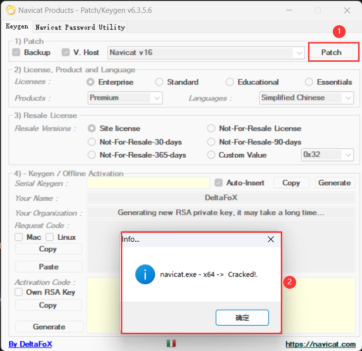
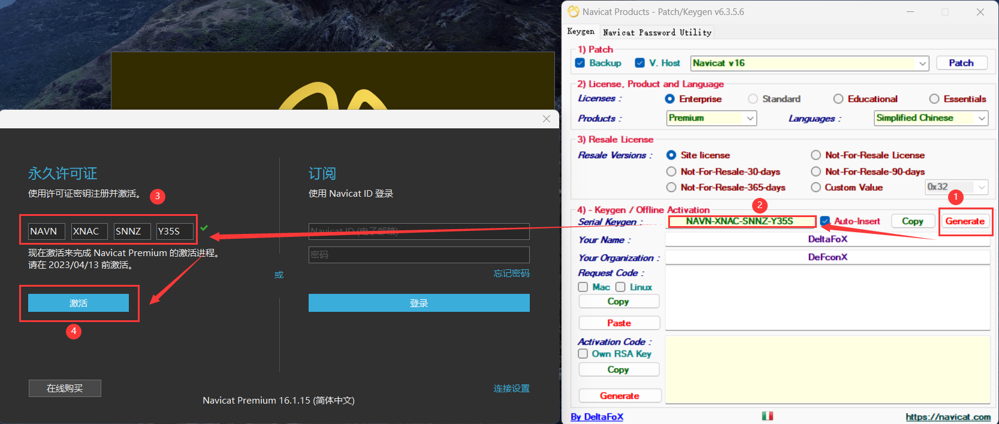
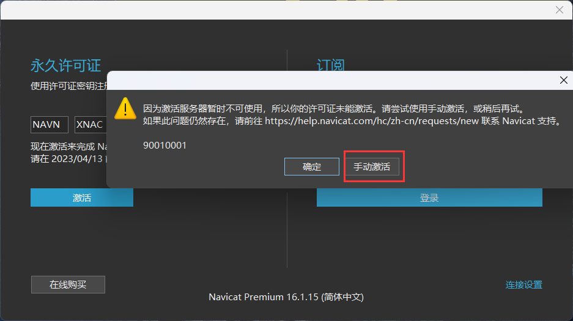
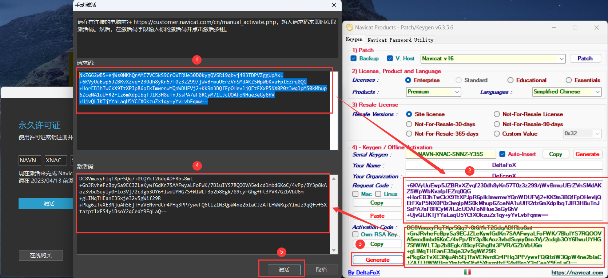
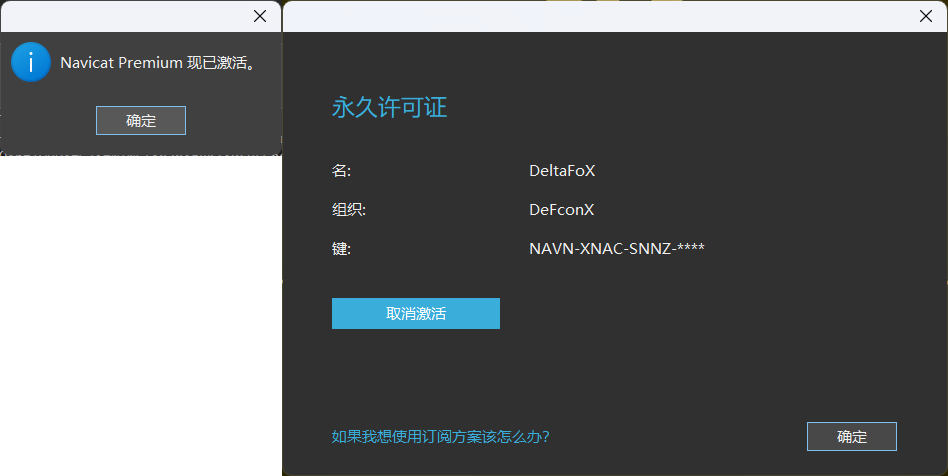

## 激活教程

1. 将破解补丁复制到 Navicat 软件安装目录
2. 以 管理员 身份运行破解补丁
3. 选择自己要激活软件的对应选项，然后点击 Patch
   
4. 断网，点击 Generate，然后将生成的激活码复制到 Navicat 软件中
5. 选择 手动激活
   
6. 将 请求码 复制到破解补丁中，然后点击破解补丁左下角的 Generate 生成 激活码，然后将 激活码 复制到 Navicat 软件中（正常情况下会自动填充），然后点击 激活 按钮
   
7. 至此 Navicat 激活成功！
   